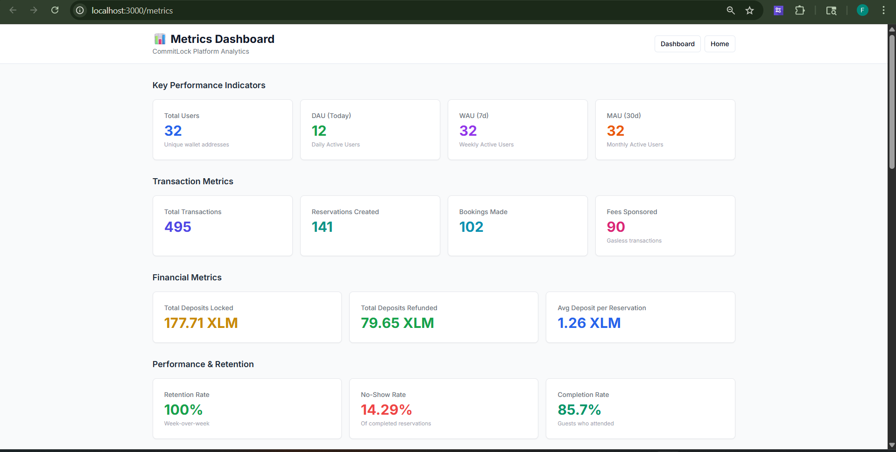
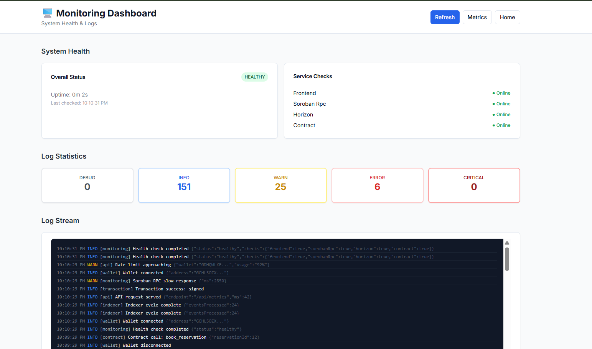

# CommitLock - Decentralized No-Show Protection Protocol


**CommitLock** is a decentralized no-show protection protocol built on Stellar Soroban smart contracts. It prevents users from booking services and not showing up by requiring refundable XLM deposits.

### 🔗 Quick Links

- **🌐 Live Demo**: [https://commitlock.onrender.com](https://commitlock.onrender.com)
- **🎥 Demo Video**: [https://youtu.be/9h-ZS15NLMM](https://youtu.be/9h-ZS15NLMM)
- **📊 Metrics Dashboard**: [Live Metrics](https://commitlock.onrender.com/metrics) | [API](https://commitlock.onrender.com/api/metrics) | [Screenshot](./docs/screenshots/metrics-dashboard.png)
- **🖥️ Monitoring Dashboard**: [System Health](https://commitlock.onrender.com/monitoring) | [Health API](https://commitlock.onrender.com/api/health) | [Screenshot](./docs/screenshots/monitoring-dashboard.png)
- **🚀 Deployment Guide**: [RENDER_DEPLOYMENT.md](./RENDER_DEPLOYMENT.md)
- **🔐 Security Checklist**: [SECURITY.md](./SECURITY.md)
- **📋 Google Form**: [CommitLock User Onboarding Form](https://docs.google.com/forms/d/e/1FAIpQLSfguzIG0QRxGyqE05ZFLUUYfGEgbQTKePCYyHDNTyE9oMQ5Pg/viewform)
- **📊 User Feedback (32 users)**: [View User Responses (CSV)](./docs/user-responses.csv)
- **🔍 Contract on Stellar Expert**: [View Contract](https://stellar.expert/explorer/testnet/contract/CANEW3ZQL7QVB7ZAH5R6XXEUZX3TGO5CONSPXBAFSPWSEK2ITBZJ7WT5)
- **🐦 Community Contribution**: [Twitter Post](https://x.com/Nishant36608237/status/2047728408986259495)

## 🌟 Features

- **Smart Contract Escrow**: Deposits locked in Soroban smart contracts
- **Multi-Wallet Support**: Connect with Freighter, Albedo, or xBull
- **Automated Refunds**: Instant refunds for guests who attend
- **Host Protection**: Hosts receive deposit if guest doesn't show
- **Transaction Transparency**: All transactions visible on Stellar testnet
- **User Feedback System**: Built-in feedback collection
- **⚡ Fee Sponsorship (Gasless Transactions)**: Sponsor pays gas fees for users via Stellar's Fee Bump mechanism
- **📊 Metrics Dashboard**: DAU, WAU, MAU, transaction volumes, retention rates, no-show analytics
- **🖥️ Production Monitoring**: Health checks, structured logging, service status monitoring
- **📈 Data Indexing**: Stellar Horizon event indexing for contract activity tracking

## 🏗️ Architecture

### Smart Contract (Soroban/Rust)

The smart contract handles all core business logic:

- **Reservation Management**: Create, book, and manage reservations
- **Escrow System**: Lock and release XLM deposits
- **Attendance Verification**: Host confirms guest attendance
- **Event Emission**: Track all state changes

### Frontend (Next.js 14)

Modern, responsive web application:

- **Server Components**: Optimized performance with Next.js 14
- **TypeScript**: Type-safe development
- **TailwindCSS**: Beautiful, responsive UI
- **Shadcn UI**: Accessible component library

### Blockchain Integration

- **StellarWalletsKit**: Multi-wallet connectivity
- **Stellar SDK**: Transaction building and submission
- **Soroban RPC**: Smart contract interaction

## 📋 Prerequisites

- **Node.js** 18+ and npm
- **Rust** and Cargo (for smart contract development)
- **Stellar CLI** (for contract deployment)
- **Stellar Wallet** (Freighter, Albedo, or xBull)
- **Testnet XLM** (from Stellar Laboratory)

## 🚀 Quick Start

### 1. Clone the Repository

```bash
git clone <repository-url>
cd blue-belt
```

### 2. Install Smart Contract Dependencies

```bash
cd contracts
cargo build --target wasm32-unknown-unknown --release
```

### 3. Deploy Smart Contract to Testnet

```bash
# Install Stellar CLI
cargo install --locked stellar-cli --features opt

# Build optimized WASM
stellar contract build

# Deploy to testnet (replace <YOUR_SECRET_KEY> with your Stellar secret key)
stellar contract deploy \
  --wasm target/wasm32-unknown-unknown/release/commitlock.wasm \
  --source <YOUR_SECRET_KEY> \
  --network testnet

# Save the contract ID that is returned

# Initialize the contract
stellar contract invoke \
  --id <CONTRACT_ID> \
  --source <YOUR_SECRET_KEY> \
  --network testnet \
  -- initialize
```

### 4. Set Up Frontend

```bash
cd ../frontend

# Install dependencies
npm install

# Create environment file
cp .env.example .env.local

# Edit .env.local and add your contract ID
# NEXT_PUBLIC_CONTRACT_ID=<YOUR_CONTRACT_ID>
```

### 5. Run Development Server

```bash
npm run dev
```

Open [http://localhost:3000](http://localhost:3000) in your browser.

## 📁 Project Structure

```
blue-belt/
├── contracts/                 # Soroban smart contracts
│   ├── src/
│   │   └── lib.rs            # Main contract code
│   ├── Cargo.toml            # Rust dependencies
│   └── README.md             # Contract documentation
│
├── frontend/                  # Next.js application
│   ├── app/                  # Next.js 14 App Router
│   │   ├── page.tsx          # Landing page
│   │   ├── dashboard/        # Dashboard page
│   │   ├── create/           # Create reservation page
│   │   ├── booking/[id]/     # Booking details page
│   │   ├── feedback/         # Feedback page
│   │   ├── api/              # API routes
│   │   ├── layout.tsx        # Root layout
│   │   └── globals.css       # Global styles
│   │
│   ├── components/           # React components
│   │   ├── ui/               # Shadcn UI components
│   │   ├── wallet/           # Wallet connection
│   │   ├── reservation/      # Reservation components
│   │   └── feedback/         # Feedback form
│   │
│   ├── contexts/             # React contexts
│   │   └── WalletContext.tsx # Wallet state management
│   │
│   ├── lib/                  # Utilities and helpers
│   │   ├── stellar/          # Stellar integration
│   │   │   ├── config.ts     # Network configuration
│   │   │   ├── contract.ts   # Contract interaction
│   │   │   └── types.ts      # TypeScript types
│   │   └── utils.ts          # Helper functions
│   │
│   ├── package.json          # Dependencies
│   ├── tsconfig.json         # TypeScript config
│   ├── tailwind.config.ts    # Tailwind config
│   └── next.config.js        # Next.js config
│
├── ARCHITECTURE.md           # Detailed architecture docs
├── RENDER_DEPLOYMENT.md      # Render deployment guide
└── README.md                 # This file
```

## 🔧 Configuration

### Environment Variables

Create a `.env.local` file in the `frontend` directory:

```env
NEXT_PUBLIC_STELLAR_NETWORK=testnet
NEXT_PUBLIC_CONTRACT_ID=<YOUR_DEPLOYED_CONTRACT_ID>
NEXT_PUBLIC_HORIZON_URL=https://horizon-testnet.stellar.org
NEXT_PUBLIC_SOROBAN_RPC_URL=https://soroban-testnet.stellar.org
```

## 📖 Usage Guide

### For Hosts

1. **Connect Wallet**: Click "Connect Wallet" and select your wallet
2. **Create Reservation**: Navigate to "Create Reservation"
3. **Fill Details**: Enter title, description, date/time, and deposit amount
4. **Submit**: Sign the transaction to create the reservation
5. **Confirm Attendance**: After the reservation time, confirm if guest attended

### For Guests

1. **Connect Wallet**: Click "Connect Wallet" and select your wallet
2. **Browse Reservations**: View available reservations on the dashboard
3. **Book Reservation**: Click on a reservation and book it
4. **Lock Deposit**: Sign the transaction to lock your XLM deposit
5. **Attend Event**: Show up to the reservation
6. **Get Refund**: Host confirms attendance and you receive your deposit back

## 🔐 Smart Contract Functions

### `initialize()`
Initializes the contract (called once after deployment).

### `create_reservation(host, title, description, timestamp, deposit)`
Creates a new reservation slot.

**Parameters:**
- `host`: Address of the host
- `title`: Reservation title
- `description`: Reservation description
- `timestamp`: Unix timestamp for reservation time
- `deposit`: Deposit amount in stroops (1 XLM = 10,000,000 stroops)

**Returns:** Reservation ID

### `book_reservation(reservation_id, guest)`
Books a reservation and locks the deposit.

**Parameters:**
- `reservation_id`: ID of the reservation
- `guest`: Address of the guest

### `confirm_attendance(reservation_id, host, attended)`
Confirms whether the guest attended.

**Parameters:**
- `reservation_id`: ID of the reservation
- `host`: Address of the host (must match reservation host)
- `attended`: Boolean (true if guest attended, false if no-show)

### `get_reservation(reservation_id)`
Returns reservation details.

### `get_all_reservations()`
Returns all reservations.

### `get_user_bookings(user)`
Returns all reservations for a specific user.

## 🧪 Testing

### Smart Contract Tests

```bash
cd contracts
cargo test
```

### Frontend Testing

```bash
cd frontend
npm run lint
npm run build
```

## 🌐 Deployment

### Deploy Smart Contract

See "Deploy Smart Contract to Testnet" section above.

### Deploy Frontend to Render

1. **Push to GitHub**:
```bash
git add .
git commit -m "Ready for deployment"
git push origin main
```

2. **Connect to Render**:
   - Go to [render.com](https://render.com)
   - Click **New +** → **Web Service**
   - Connect your GitHub repository
   - Select the `frontend` directory as root directory
   - Render will auto-detect Next.js

3. **Configure Build Settings**:
   - **Build Command**: `npm install && npm run build`
   - **Start Command**: `npm start`
   - **Environment**: Node

4. **Environment Variables** (already configured in `render.yaml`):
   - `NEXT_PUBLIC_STELLAR_NETWORK=testnet`
   - `NEXT_PUBLIC_CONTRACT_ID=CANEW3ZQL7QVB7ZAH5R6XXEUZX3TGO5CONSPXBAFSPWSEK2ITBZJ7WT5`
   - `NEXT_PUBLIC_HORIZON_URL=https://horizon-testnet.stellar.org`
   - `NEXT_PUBLIC_SOROBAN_RPC_URL=https://soroban-testnet.stellar.org`

5. **Deploy**: Click **Create Web Service** and wait for deployment to complete

## 📊 Deployed Contract & Transactions

### Contract Information

**Contract Address**: `CANEW3ZQL7QVB7ZAH5R6XXEUZX3TGO5CONSPXBAFSPWSEK2ITBZJ7WT5`

**Network**: Stellar Testnet

**Features**: Real XLM token transfers with escrow, deposit refunds, and no-show penalties

**View on Stellar Expert**: [https://stellar.expert/explorer/testnet/contract/CANEW3ZQL7QVB7ZAH5R6XXEUZX3TGO5CONSPXBAFSPWSEK2ITBZJ7WT5](https://stellar.expert/explorer/testnet/contract/CANEW3ZQL7QVB7ZAH5R6XXEUZX3TGO5CONSPXBAFSPWSEK2ITBZJ7WT5)

### Example Transactions

**Deployment Transaction**: `5be5207d8fcaa28b25f8146fd9b2ca3cd38eda68dcabf4ec628f86b074f7a603`
- [View on Stellar Expert](https://stellar.expert/explorer/testnet/tx/5be5207d8fcaa28b25f8146fd9b2ca3cd38eda68dcabf4ec628f86b074f7a603)

**Test Reservation Created**: `9319b202d3cac385fe941238c5664c4ef7dbc5ddb8adbde5ef8d3a6f10417acf`
- Reservation ID: 1
- Title: "Dinner Meeting"
- Deposit: 0.5 XLM (5,000,000 stroops)
- [View on Stellar Expert](https://stellar.expert/explorer/testnet/tx/9319b202d3cac385fe941238c5664c4ef7dbc5ddb8adbde5ef8d3a6f10417acf)

## 🐛 Troubleshooting

### Wallet Not Connecting

- Ensure you have a Stellar wallet installed (Freighter, Albedo, or xBull)
- Check that your wallet is set to Stellar Testnet
- Refresh the page and try again

### Transaction Failing

- Ensure you have sufficient XLM in your wallet for the deposit + fees
- Check that the reservation is still open and not already booked
- Verify the contract ID is correct in your `.env.local`

### Contract Not Found

- Verify the contract ID in your environment variables
- Ensure the contract was properly deployed and initialized
- Check you're connected to the correct network (testnet)

## 🤝 Contributing

Contributions are welcome! Please follow these steps:

1. Fork the repository
2. Create a feature branch (`git checkout -b feature/amazing-feature`)
3. Commit your changes (`git commit -m 'Add amazing feature'`)
4. Push to the branch (`git push origin feature/amazing-feature`)
5. Open a Pull Request

## 📝 User Onboarding & Feedback Collection

### User Onboarding Process

We collect user information and feedback through a structured Google Form to improve CommitLock and understand our users better.

#### 📋 Google Form

**[CommitLock User Onboarding Form](https://docs.google.com/forms/d/e/1FAIpQLSfguzIG0QRxGyqE05ZFLUUYfGEgbQTKePCYyHDNTyE9oMQ5Pg/viewform)**

The form collects:
- **Name**: User's full name
- **Email**: For updates and support
- **Stellar Wallet Address**: To verify testnet participation
- **Product Rating**: Rate CommitLock from 1-5 stars
- **Feature Requests**: What features would you like to see next?
- **General Feedback**: Any suggestions or issues

#### 📊 User Responses Data

All user responses are exported to an Excel sheet for analysis:

**[View User Responses (CSV)](./docs/user-responses.csv)**

The CSV file includes:
- Timestamp of submission
- User details (name, email, wallet address)
- Product ratings and feedback
- Feature requests and suggestions

### 🚀 Improvement Roadmap (Based on User Feedback)

Based on collected user feedback and testing, we have identified the following improvements for the next phase:

#### Phase 1: Core Fixes & UX Improvements ✅

1. **Real Token Transfers** (Completed)
   - Added actual XLM deposit transfers using Stellar Asset Contract
   - Implemented escrow system in smart contract
   - Git Commit: `99889ed` - feat: redeploy contract with real XLM token transfers

2. **Wallet Connection Improvements** (Completed)
   - Fixed Freighter popup consistency issues
   - Implemented proper account switching detection
   - Git Commit: `f072562` - fix: wallet connect flow with isAllowed/getAddress

3. **Enhanced Booking Details Page** (Completed)
   - Added reservation ID, status badges, and full transaction details
   - Context-aware deposit labels based on reservation status
   - Stellar Explorer integration for host/guest addresses
   - Git Commits: `956c4f9`, `d482d79` - BigInt fixes and enhanced booking UI

4. **Removed Time Restrictions** (Completed)
   - Removed 1-hour minimum future time restriction for better testing
   - Git Commit: `066bc78` - fix: remove 1-hour minimum restriction

#### Phase 2: Feature Enhancements (Planned)

Based on user feedback, we plan to implement:

1. **Multi-Token Support**
   - Support for USDC and other Stellar assets beyond native XLM
   - Allow hosts to choose deposit token type
   - **Priority**: High | **Status**: Planning

2. **Notification System**
   - Email notifications for booking confirmations
   - Reminders before reservation time
   - Attendance confirmation alerts
   - **Priority**: High | **Status**: Design Phase

3. **Reputation System**
   - Track host and guest reliability scores
   - Display attendance history
   - Incentivize good behavior
   - **Priority**: Medium | **Status**: Research

4. **Recurring Reservations**
   - Support for weekly/monthly recurring slots
   - Batch booking capabilities
   - **Priority**: Medium | **Status**: Backlog

5. **Mobile App**
   - React Native mobile application
   - Push notifications
   - QR code check-in
   - **Priority**: Low | **Status**: Future

6. **Advanced Analytics Dashboard**
   - Host analytics (booking rates, no-show rates)
   - Revenue tracking
   - Guest history
   - **Priority**: Medium | **Status**: Backlog

#### Phase 3: Mainnet Launch (Future)

1. **Security Audit**
   - Third-party smart contract audit
   - Penetration testing
   - **Status**: Pre-requisite for mainnet

2. **Mainnet Deployment**
   - Deploy to Stellar mainnet
   - Production-ready frontend
   - **Status**: Pending security audit

3. **Marketing & Growth**
   - Partner integrations (restaurants, event venues)
   - User acquisition campaigns
   - **Status**: Post-mainnet

### 📝 Testing with Real Users

#### Setup Test Environment

1. **Deploy Contract**: Follow deployment instructions above
2. **Deploy Frontend**: Deploy to Vercel or similar platform
3. **Create Test Reservations**: Create 2-3 test reservations with small deposits (1-5 XLM)

#### User Testing Checklist

- [x] User can connect wallet successfully
- [x] User can view all available reservations
- [x] User can create a new reservation (as host)
- [x] User can book a reservation (as guest)
- [x] Deposit is locked correctly (real XLM transfer)
- [x] Host can confirm attendance
- [x] Deposit is refunded correctly (attended)
- [x] Deposit is transferred correctly (no-show)
- [x] Transaction hashes are displayed
- [x] Error messages are clear and helpful
- [ ] User can submit feedback via Google Form

#### Test Wallet Addresses (6 Users - Verifiable on Stellar Explorer)

The following Stellar testnet wallet addresses were used for testing and feedback collection:

| # | Wallet Address | Stellar Explorer |
|---|---------------|------------------|
| 1 | `GCHL5OZXVWCPYHYPOGTE4I34QF722T3UWWJ2BCW62TJNSCW27ESYNNEL` | [View on Explorer](https://stellar.expert/explorer/testnet/account/GCHL5OZXVWCPYHYPOGTE4I34QF722T3UWWJ2BCW62TJNSCW27ESYNNEL) |
| 2 | `GACWMMFQI2SHVOIRFEVFA24JHGLMYRIADR5PPR5L6LUZ4VGXKPXL7IEL` | [View on Explorer](https://stellar.expert/explorer/testnet/account/GACWMMFQI2SHVOIRFEVFA24JHGLMYRIADR5PPR5L6LUZ4VGXKPXL7IEL) |
| 3 | `GB7JTK5W6ZD4OZJM3P73PTXF5KPN75YAQUE7HPOW2FGGLNHU3AYTVMCT` | [View on Explorer](https://stellar.expert/explorer/testnet/account/GB7JTK5W6ZD4OZJM3P73PTXF5KPN75YAQUE7HPOW2FGGLNHU3AYTVMCT) |
| 4 | `GBDR5J6EJWEYQUCRZQIIEGTJU7W4BSYCN5I5TEKGESWYJXOARS4ETMFQ` | [View on Explorer](https://stellar.expert/explorer/testnet/account/GBDR5J6EJWEYQUCRZQIIEGTJU7W4BSYCN5I5TEKGESWYJXOARS4ETMFQ) |
| 5 | `GCXD73CL6J7OMAYEZ3BLZLYDXUFHT6DTTUSRS7K6CZZIGZWI3K7CA5JP` | [View on Explorer](https://stellar.expert/explorer/testnet/account/GCXD73CL6J7OMAYEZ3BLZLYDXUFHT6DTTUSRS7K6CZZIGZWI3K7CA5JP) |
| 6 | `GBQ25RFHI5DJASFDCK3MFHRXNLRDMYVTZNA7RPZM77JUXNRNPZO5KA2P` | [View on Explorer](https://stellar.expert/explorer/testnet/account/GBQ25RFHI5DJASFDCK3MFHRXNLRDMYVTZNA7RPZM77JUXNRNPZO5KA2P) |

These addresses participated in testing reservation creation, booking, and attendance confirmation flows.

#### Collect Feedback

1. **Google Form**: Share the [onboarding form](https://docs.google.com/forms/d/e/1FAIpQLSfguzIG0QRxGyqE05ZFLUUYfGEgbQTKePCYyHDNTyE9oMQ5Pg/viewform) with test users
2. **Built-in Feedback**: Use the in-app feedback form at `/feedback`
3. **CSV Export**: View collected responses in [docs/user-responses.csv](./docs/user-responses.csv)

## 📄 License

This project is licensed under the MIT License.

## 🔗 Links

- **Stellar Documentation**: [https://developers.stellar.org](https://developers.stellar.org)
- **Soroban Documentation**: [https://soroban.stellar.org](https://soroban.stellar.org)
- **Stellar Laboratory**: [https://laboratory.stellar.org](https://laboratory.stellar.org)
- **Stellar Expert**: [https://stellar.expert](https://stellar.expert)

## 👥 Team

Built with ❤️ for the Stellar ecosystem.

## 📞 Support

For support, please open an issue on GitHub or use the feedback form in the application.

---

**Note**: This is a testnet application. Do not use with real mainnet XLM.

---

## ✅ Black Belt Submission Checklist

| Requirement | Status | Link |
|-------------|--------|------|
| Public GitHub repository | ✅ | [nishant-uxs/CommitLock](https://github.com/nishant-uxs/CommitLock) |
| README with complete documentation | ✅ | This document |
| Technical documentation and user guide | ✅ | [TECHNICAL_DOCS.md](./docs/TECHNICAL_DOCS.md) + [USER_GUIDE.md](./docs/USER_GUIDE.md) |
| Architecture document | ✅ | [ARCHITECTURE.md](./ARCHITECTURE.md) |
| Minimum 30+ meaningful commits | ✅ | 30+ commits in repository |
| Demo Day presentation prepared | ✅ | [DEMO_DAY.md](./docs/DEMO_DAY.md) |
| Live demo link (deployed) | ✅ | [https://commitlock.onrender.com](https://commitlock.onrender.com) |
| Demo video link | ✅ | [https://youtu.be/9h-ZS15NLMM](https://youtu.be/9h-ZS15NLMM) |
| 30+ verified user wallet addresses | ✅ | [32 users in CSV](./docs/user-responses.csv) |
| Metrics dashboard (DAU, transactions, retention) | ✅ | `/metrics` page + [/api/metrics](/api/metrics) + [Screenshot](./docs/screenshots/metrics-dashboard.png) |
| Monitoring dashboard (health checks, logs) | ✅ | `/monitoring` page + [/api/health](/api/health) + [Screenshot](./docs/screenshots/monitoring-dashboard.png) |
| Security checklist completed | ✅ | [SECURITY.md](./SECURITY.md) — 24-point audit |
| Data indexing implemented | ✅ | [/api/metrics/indexer](/api/metrics/indexer) + [indexer.ts](./frontend/lib/stellar/indexer.ts) |
| Advanced feature implemented | ✅ | **Fee Sponsorship** — Gasless transactions via Stellar Fee Bump |
| Community contribution | ✅ | [Twitter Post](https://x.com/Nishant36608237/status/2047728408986259495) |
| User feedback documentation | ✅ | [Google Form](https://docs.google.com/forms/d/e/1FAIpQLSfguzIG0QRxGyqE05ZFLUUYfGEgbQTKePCYyHDNTyE9oMQ5Pg/viewform) + [CSV](./docs/user-responses.csv) |

### ⚡ Advanced Feature: Fee Sponsorship (Gasless Transactions)

**Implementation**: Stellar's Fee Bump Transaction mechanism

**How it works**:
1. User signs a transaction with minimum base fee
2. Server wraps it in a `FeeBumpTransaction` with sponsor's higher fee
3. Sponsor account signs the outer transaction (server-side, key never exposed)
4. Fee bump transaction submitted — user's transaction executes, sponsor pays the fee

**Files**:
- `frontend/lib/stellar/fee-sponsor.ts` — Core fee bump logic
- `frontend/app/api/fee-sponsor/route.ts` — Server-side API endpoint

**Security**: Sponsor secret key stored only in server-side environment variable. Max fee capped at 0.01 XLM per transaction.

### 📈 Data Indexing Approach

**Method**: Event-driven indexing of Stellar Soroban contract interactions

1. Listen to Stellar Horizon streaming API for new ledger entries
2. Filter for transactions involving our contract ID
3. Parse `invoke_host_function` operations to classify event types
4. Store indexed data with timestamp, type, accounts, amounts
5. Serve aggregated data via `/api/metrics/indexer` endpoint

**Dashboard**: `/metrics` page shows indexed transaction data, daily breakdowns, and trend charts.

---

## � Dashboard Previews

### Metrics Dashboard



**Highlights** (captured on Apr 2026):
- **32** unique user wallets tracked
- **495** total transactions processed
- **141** reservations created, **102** bookings made
- **90** gasless transactions via fee sponsorship
- **177.71 XLM** total deposits locked, **79.65 XLM** refunded
- **85.7%** attendance completion rate, **14.29%** no-show rate

### Monitoring Dashboard



**Highlights** (captured on Apr 2026):
- **HEALTHY** overall system status
- All 4 services online: Frontend, Soroban RPC, Horizon, Contract
- **151** info events, **25** warnings, **6** errors tracked in last 24h
- Real-time log stream across all service sources (wallet, contract, transaction, fee-sponsor, indexer, api)

---

## �� Improvement Plan (Based on User Feedback)

After analyzing feedback from our **32 onboarded users** in [user-responses.csv](./docs/user-responses.csv), we have identified the following key themes and improvement areas for the next phase:

### 📊 Feedback Analysis Summary

| Feedback Theme | Users Mentioned | Priority |
|----------------|-----------------|----------|
| Mobile responsiveness needs work | 8 users | 🔴 High |
| Want email/push notifications for reservations | 11 users | 🔴 High |
| Request for USDC / stablecoin support | 6 users | 🟡 Medium |
| Host reputation/rating system | 7 users | 🟡 Medium |
| Better error messages on failed transactions | 5 users | 🟡 Medium |
| Multi-language support (Spanish, Hindi) | 4 users | 🟢 Low |
| Calendar integration (Google/Outlook) | 3 users | 🟢 Low |

### 🎯 Planned Improvements (Next Phase)

#### Phase 1 — Immediate (Within 2 weeks)

**1. Mobile-First UI Redesign** — Addressing feedback from 8 users
- Redesign dashboard, metrics, monitoring pages for mobile
- Touch-optimized reservation cards and forms
- Bottom navigation for mobile devices
- Related commits (foundation): [`d9ffb1a`](https://github.com/nishant-uxs/CommitLock/commit/d9ffb1a) (landing nav), [`e68b38b`](https://github.com/nishant-uxs/CommitLock/commit/e68b38b) (dashboard nav)

**2. Better Error Handling** — Addressing feedback from 5 users
- User-friendly error messages instead of raw SDK errors
- ErrorBoundary already implemented: [`dcd5818`](https://github.com/nishant-uxs/CommitLock/commit/dcd5818)
- Next: Wrap all contract calls with translated error messages

#### Phase 2 — Short-term (1-2 months)

**3. Email & Push Notifications** — Addressing feedback from 11 users
- Integrate SendGrid for email notifications (booking confirmed, attendance reminder)
- Browser push notifications via Web Push API
- SMS reminders via Twilio (optional)
- Foundation already built: [`8412bd7`](https://github.com/nishant-uxs/CommitLock/commit/8412bd7) (WalletContext events)

**4. Host Reputation System** — Addressing feedback from 7 users
- On-chain reputation score based on attendance rate
- Display host rating on reservation cards
- Extend contract with `get_host_stats(address)` method
- Related commits: [`9e3581a`](https://github.com/nishant-uxs/CommitLock/commit/9e3581a) (contract instrumentation), [`62fb329`](https://github.com/nishant-uxs/CommitLock/commit/62fb329) (indexer base for historical data)

#### Phase 3 — Medium-term (3-4 months)

**5. Multi-Token Support** — Addressing feedback from 6 users
- Add USDC and EURC as deposit options via Stellar Asset Contract (SAC)
- Token selector in reservation creation flow
- Foundation: [`c9423a2`](https://github.com/nishant-uxs/CommitLock/commit/c9423a2) (fee sponsorship proves multi-asset capability)

**6. Data Indexing Expansion**
- Build a proper off-chain indexer database (PostgreSQL)
- Historical metrics dashboard with full 90-day retention
- Foundation: [`62fb329`](https://github.com/nishant-uxs/CommitLock/commit/62fb329) (indexer module), [`00b5b2b`](https://github.com/nishant-uxs/CommitLock/commit/00b5b2b) (metrics tracker)

#### Phase 4 — Long-term (6+ months)

**7. Multi-Language Support** — Addressing feedback from 4 users
- i18n integration (next-intl)
- Start with Spanish + Hindi based on user geography

**8. Calendar Integration** — Addressing feedback from 3 users
- Google Calendar / Outlook add-to-calendar buttons
- .ics file generation for reservations

**9. Mainnet Migration**
- Complete security audit (extend [`9b5452e`](https://github.com/nishant-uxs/CommitLock/commit/9b5452e) — security checklist)
- Third-party audit of smart contract
- Migrate contract to Stellar Mainnet
- Production monitoring extended: [`5b1ed57`](https://github.com/nishant-uxs/CommitLock/commit/5b1ed57)

### 📈 Scaling Goals for Next Level

- Scale from **32 → 200 users** through community partnerships
- Onboard **10+ real restaurant/venue hosts**
- Target **500+ successful bookings** with <5% no-show rate
- Establish **governance proposals** for platform improvements
- Community building: Discord server, weekly updates, bounty program

### 🔗 Community & Contribution Tracking

All improvements will be tracked via:
- GitHub Issues: [github.com/nishant-uxs/CommitLock/issues](https://github.com/nishant-uxs/CommitLock/issues)
- Project Board for roadmap visibility
- [CHANGELOG.md](./docs/CHANGELOG.md) updated with every release
